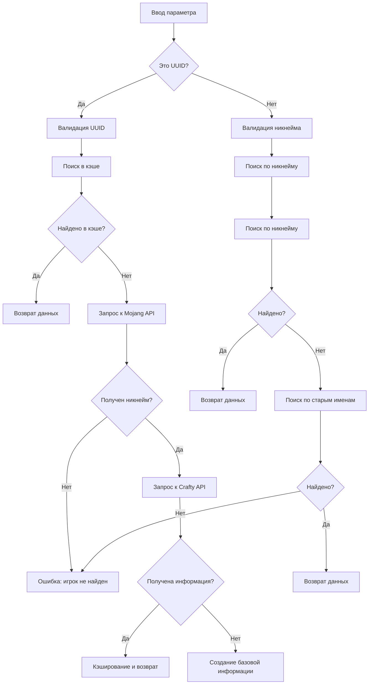

# Поиск по UUID в команде /court

## 🆕 Новая функциональность

Команда `/court` теперь поддерживает поиск игроков как по никнейму, так и по UUID.

## 📋 Возможности

### Поиск по никнейму (как раньше)
```
/court PlayerName
```

### Поиск по UUID (новая функция)
```
/court 2c104d7ab88c48f1a9991f9b6a8495ce
/court 2c104d7a-b88c-48f1-a999-1f9b6a8495ce
```

## 🔧 Как это работает

### 1. Автоматическое определение типа поиска
Бот автоматически определяет, является ли введенный параметр UUID или никнеймом:

- **UUID формат**: `xxxxxxxx-xxxx-xxxx-xxxx-xxxxxxxxxxxx` или `xxxxxxxxxxxxxxxxxxxxxxxxxxxxxxxx`
- **Никнейм формат**: от 3 до 16 символов, буквы, цифры и подчеркивания

### 2. Процесс поиска по UUID
1. **Валидация UUID** - проверка корректности формата
2. **Поиск в кэше** - проверка базы данных на наличие информации
3. **Получение никнейма** - запрос к Mojang API для получения текущего никнейма
4. **Получение полной информации** - запрос к Crafty API для получения истории имен
5. **Кэширование результатов** - сохранение информации в базе данных

### 3. API источники
- **Mojang API** (`sessionserver.mojang.com`) - получение текущего никнейма по UUID
- **Crafty API** (`api.crafty.gg`) - получение полной истории имен и информации
- **Локальная база данных** - кэширование результатов для ускорения

## 📊 Примеры использования

### Поиск администратора
```
/court 2c104d7ab88c48f1a9991f9b6a8495ce
```
Результат: информация об OsterMiner

### Поиск игрока с дефисами в UUID
```
/court 4e8f921b-25b1-47f7-b026-9040baae6237
```
Результат: информация о GGno4ka

### Поиск по никнейму (как раньше)
```
/court PlayerName
```
Результат: информация о PlayerName

## 🔍 Алгоритм работы



## ⚙️ Технические детали

### Валидация UUID
```python
def validate_uuid(uuid: str) -> bool:
    import re
    uuid_pattern = re.compile(r'^[0-9a-f]{8}-?[0-9a-f]{4}-?[0-9a-f]{4}-?[0-9a-f]{4}-?[0-9a-f]{12}$', re.IGNORECASE)
    return bool(uuid_pattern.match(uuid))
```

### Нормализация UUID
- Удаление дефисов для внутреннего использования
- Добавление дефисов для Mojang API

### Кэширование
- **player_cache** - полная информация об игроке
- **player_names** - история имен игрока
- **TTL кэш** - временное кэширование в памяти

## 🚀 Преимущества

### Для пользователей
- ✅ **Гибкость поиска** - можно искать как по никнейму, так и по UUID
- ✅ **Совместимость** - старые команды продолжают работать
- ✅ **Быстрый поиск** - кэширование ускоряет повторные запросы
- ✅ **Надежность** - fallback на базовую информацию при недоступности API

### Для разработчиков
- ✅ **Модульность** - легко добавить новые источники данных
- ✅ **Расширяемость** - можно добавить поиск по другим параметрам
- ✅ **Производительность** - многоуровневое кэширование
- ✅ **Надежность** - обработка ошибок и fallback механизмы

## 🧪 Тестирование

Для тестирования функциональности создан скрипт `test_uuid_search.py`:

```bash
python test_uuid_search.py
```

Скрипт тестирует:
- Валидацию UUID
- Поиск в кэше
- Получение информации через API
- Кэширование результатов

## 📝 Обновления

### Версия 1.0
- ✅ Добавлена поддержка поиска по UUID
- ✅ Автоматическое определение типа поиска
- ✅ Интеграция с Mojang и Crafty API
- ✅ Многоуровневое кэширование
- ✅ Обновлена справка `/help`

### Планы на будущее
- 🔄 Поиск по частичному UUID
- 🔄 Поиск по нескольким UUID одновременно
- 🔄 Экспорт результатов поиска
- 🔄 Статистика использования UUID поиска

## 🆘 Устранение неполадок

### Проблема: "UUID не прошел валидацию"
**Решение**: Проверьте формат UUID. Допустимы варианты:
- `2c104d7ab88c48f1a9991f9b6a8495ce` (без дефисов)
- `2c104d7a-b88c-48f1-a999-1f9b6a8495ce` (с дефисами)

### Проблема: "Игрок не найден"
**Возможные причины**:
1. UUID не существует
2. Mojang API недоступен
3. Игрок не имеет текущего никнейма

**Решение**: Попробуйте поиск по никнейму или проверьте UUID

### Проблема: "Ошибка API"
**Решение**: Бот автоматически использует fallback механизмы. Попробуйте позже.

## 📞 Поддержка

При возникновении проблем:
1. Проверьте формат UUID
2. Убедитесь, что UUID существует
3. Попробуйте поиск по никнейму
4. Обратитесь к администрации

---

**Автор**: Court Bot Development Team  
**Версия**: 1.0  

**Дата**: 2025
